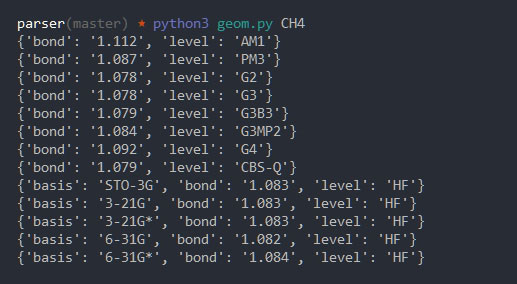
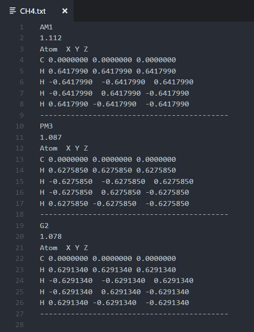

# cccbdb.nist.gov Geometry Parser

Pulls all geometry information from cccbdb.nist.gov for the specified chemical formula

## Setup

* Install Python 3

* Clone the repo to your machine

`git clone git@github.com:marcelo-mason/cccbdb-geometry-parser.git && cd cccbdb-geometry-parser`

* Install script dependencies

`python setup.py develop`

* Run the script by supplying a formula

`python geom.py CH4`

* The script will run through extracting all geometries, outputting status to the console.  It will create a text file with all the geometries for the formula in your current path. i.e. CH4.txt

# Screenshots

